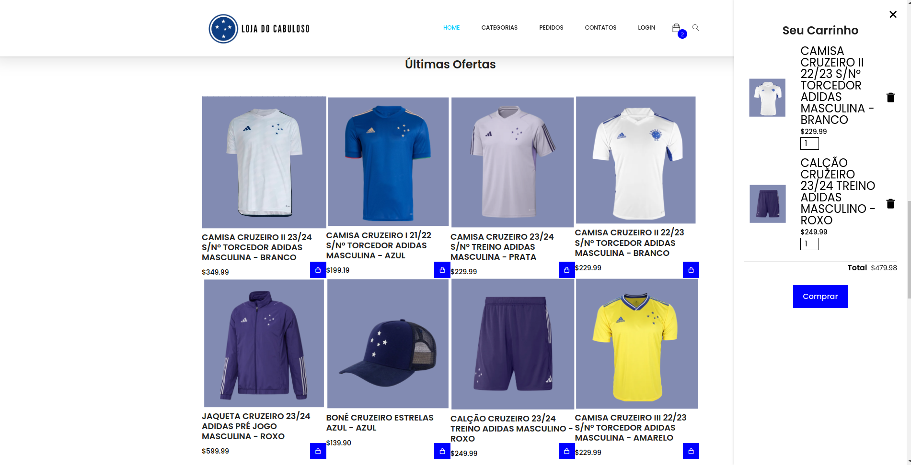
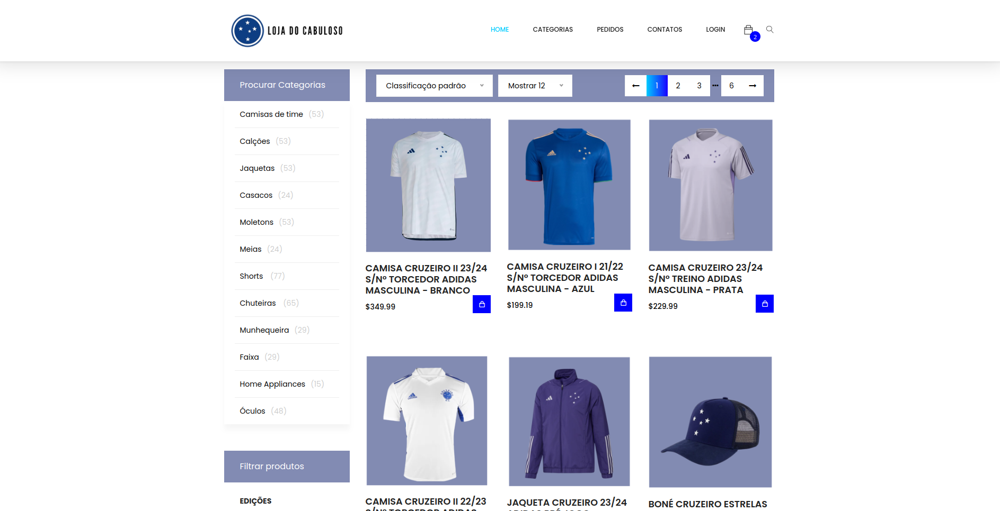
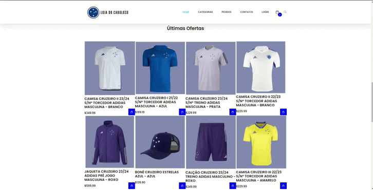
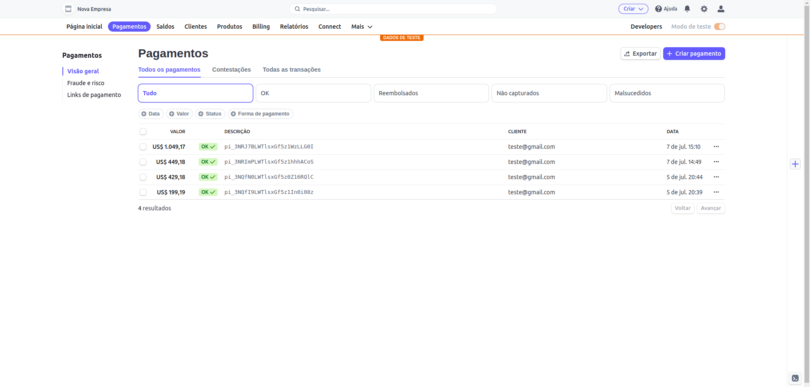
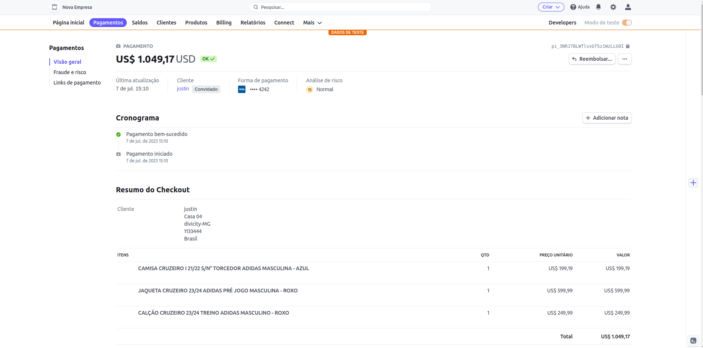
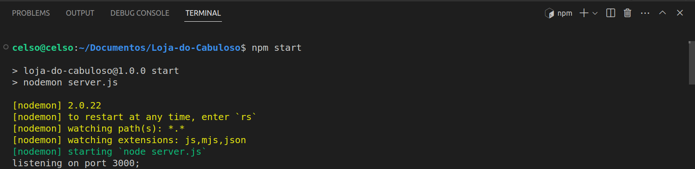
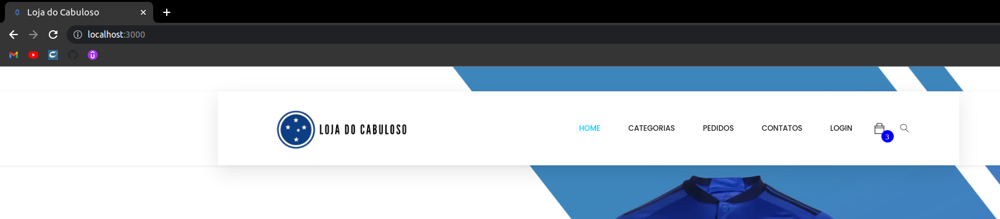

# Implementação 

  
  
  
  
  

 

# Loja do Cabuloso

  
Bem-vindo ao repositório do projeto universitário da Loja do Cabuloso! Este projeto foi desenvolvido com o objetivo de aprofundar os conhecimentos sobre as linguagens e tecnologias utilizadas no desenvolvimento de um site de comércio eletrônico. Além disso, o projeto envolve a criação de um banco de dados para armazenar informações sobre os produtos, usuários e pedidos.

A Loja do Cabuloso é um site dedicado aos torcedores do Cruzeiro, um clube de futebol brasileiro. A ideia principal do site é fornecer aos torcedores uma plataforma onde eles possam comprar produtos oficiais licenciados do clube, como camisas, bonés, jaquetas e outros itens relacionados.

A ideia inicial é de desenvolver um site que possua diversas funcionalidades que visem proporcionar uma experiência de compra agradável e conveniente para os usuários. Algumas das principais funcionalidades visadas incluem:

1. Navegação intuitiva: O site possui uma estrutura de navegação clara e organizada, permitindo que os usuários encontrem facilmente os produtos desejados. A barra de menu oferece acesso rápido às diferentes categorias de produtos.

2. Carrinho de compras: Os usuários podem adicionar produtos ao carrinho de compras enquanto navegam pelo site. Eles podem visualizar o conteúdo do carrinho, calcular o total da compra e finalizar o pedido.

3. Autenticação de usuários: O site oferece a opção de login para os usuários registrados. Isso permite que eles acessem informações personalizadas, como histórico de pedidos e dados de pagamento.

4. Processo de checkout: Os usuários podem prosseguir para o processo de checkout, fornecendo informações de envio e pagamento. O site utiliza medidas de segurança para garantir a proteção das informações sensíveis dos usuários.

5. Recursos de busca: Os usuários podem utilizar a barra de pesquisa para encontrar produtos específicos ou navegar pelas diferentes categorias disponíveis.

Além disso, o projeto envolve a implementação de um banco de dados para armazenar e gerenciar informações sobre produtos, usuários e pedidos. Se conseguirmos implementá-lo, o banco de dados permitirá o armazenamento seguro das informações, facilitando a recuperação e a atualização dos dados conforme necessário.

Em suma, espera-se que este projeto proporcione uma oportunidade de aprofundar os conhecimentos em linguagens de programação, tecnologias web e banco de dados, criando um site funcional e interativo para a Loja do Cabuloso.

# Portfólio do Projeto

 

<em>Imagem 1: Print da pagina inicial</em>

 

<em>Imagem 2: Print da home na parte de produtos</em>

 

<em>Imagem 3: Print da pagina de categorias de produtos</em>

# Carrinho de Compras

O sistema de carrinho de compras é uma parte essencial de muitos sites de comércio eletrônico, permitindo aos usuários selecionar e organizar produtos para compra de forma conveniente.  Algumas das funcionalidades são:

1. Abrir e fechar o carrinho: Ao clicar no ícone do carrinho , o carrinho é aberto, exibindo os itens adicionados. Da mesma forma, ao clicar no botão de fechar, o carrinho é fechado e ocultado.

2. Adicionar itens ao carrinho: Ao clicar no botão "Adicionar ao Carrinho" de um determinado produto, as informações do produto (como título, preço e imagem) são capturadas e um novo item é adicionado ao carrinho.

3. Remover itens do carrinho: Ao clicar nesse botão, o item correspondente é removido do carrinho.

4. Alterar a quantidade de itens: Ao modificar o valor desse campo, a quantidade do item é atualizada e o total do carrinho é recalculado.

5. Atualizar o total do carrinho;

6. Manter os itens do carrinho ao recarregar a página: Os itens adicionados ao carrinho são armazenados no armazenamento local (localStorage), permitindo que sejam mantidos mesmo após a atualização da página.

7. Atualizar o ícone do carrinho com a quantidade de itens: Isso permite exibir visualmente a quantidade de itens no ícone do carrinho.

Essas são as principais funcionalidades implementadas no código do carrinho de compras. É importante observar que algumas partes do código estão comentadas ou não foram implementadas completamente, como a funcionalidade de finalizar a compra e limpar o carrinho após o pagamento.

Após a conclusão de uma compra bem-sucedida, os detalhes do pedido são armazenados em um banco de dados específico [dashboard](dashboard.stripe.com) para o sistema de gerenciamento de pedidos. Esse banco de dados é usado para registrar as informações essenciais relacionadas aos pedidos dos clientes, permitindo um acompanhamento preciso e um melhor gerenciamento das transações.

 

<em>Imagem 4: Gif de uma compra bem suscedida no site</em>

 

<em>Imagem 5: Print do banco de dados com os itens comprados</em>

 

<em>Imagem 6: Print da venda específica armazenada no banco</em>

# Autenticação do usuário

A autenticação de usuário é uma parte essencial de muitos sistemas online, permitindo que os usuários acessem suas contas de forma segura e personalizada. Algumas das funcionalidades são:

1. Registro de usuário: Os usuários podem se cadastrar fornecendo informações como nome, endereço de e-mail e senha. Esses detalhes são armazenados no banco de dados do sistema para futuras autenticações. Existe tratamento para um email válido, preencher todos os campos e também senha com pelo menos 6 caracteres. 

2. Login: Os usuários podem fazer login usando suas credenciais registradas, fornecendo seu endereço de e-mail e senha. O sistema verifica essas informações no banco de dados e concede acesso ao usuário autenticado.

  
  

<em>Imagem 7: Tela para registrar e fazer login do usuário</em>

  

<em>Imagem 8: Tela para cadastro de usuário</em>

  

  

<em>Imagem 9: Tela com as informações de usuários cadastrados</em>

# Compilação e execução

É possível executar o projeto normalmente acessando, de preferência a pasta [index.html](https://github.com/celzin/Loja-do-Cabuloso/blob/main/public/index.html) a qual se encontra dentro da pasta "public". Porém caso queira executar o projeto através de um servidor basta seguir os passos à frente.

Digite o seguinte comando no terimal do projeto e em seguida para acessar os servidor criado utilize o mesmo URL mostrado na imagem.

 

<em>Imagem 7: Comando no terminal</em>

 

<em>Imagem 8: Url para acessar servidor</em>

